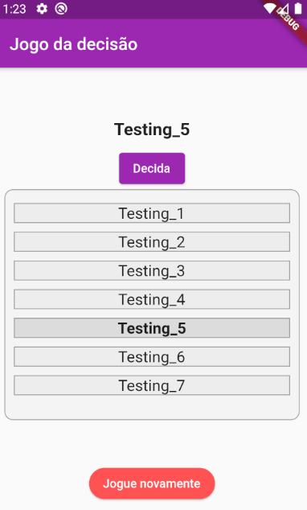

# JOGO DA DECISÃO -  DECISION GAME

Aplicativo desenvolvido em linguagem DART/flutter. 

O jogo é baseado em opções dadas pelo usuário, em que a quantidade mínina de duas opções serve para permitir que o botão para iniciar o jogo apareça.
Pois, não tem como decidir algo entre uma opção apenas. 

O jogo vai rodar todos os items do array, porém, depois de x segundos, a opção selecionada aleatoriamente vai ser marcada com um style diferente e também, o botão para rodar as opções novamente vai estar disponível, desde que as opções restantes sejam maiores que 1.

Ao clicar jogar novamente, o state é resetado.

 ## APLICAÇÃO 

| Página inicial | Transição | Jogo |
| --- | --- | --- |
|  |  | 

## O QUE FOI USADO PARA DESENVOLVER?
Por ser uma aplicação mais simples, a renderização dos widgets depende do state, usando condição lógica.
Para tornar a aplicação mais adequada para diferentes sistemas operacionais, usei CupertinoPageScaffold para IOS e Scaffold para outros dispositivos, como ANDROID.
Importei do pacote provido pelo flutter o 'dart:async', para fazer o uso do Timer e do Futurr, métodos importantes para manipular temporização dentro do aplicativo.

Fiz o uso do MediaQuery.of(context) para acessar valores como altura e largura do dispositivo, e sendo assim, criar um responsive layout para diferentes tipos de dispositivos.

Fiz o uso de uma curta animação através do AnimatedContainer na lista de opções, em que a propriedade height é alterada através de um boolean animated no state, quando true, a height calculada é usada, quando false, é dado 0.  

Para selecionar aleatoriamente um item dentro do array, foi necessário o uso do pacote 'dart:math'. Random().nextInt();

Agradeço a atenção, dê uma visualizada no repositório.
Aberto a críticas.

Obrigado, 

Desevolvido por lucascicco.

