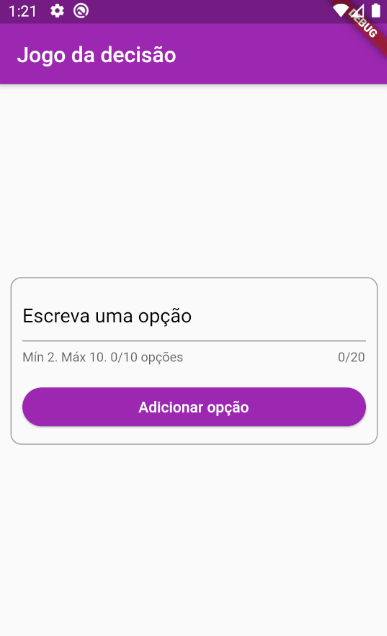

# JOGO DA DECISÃO -  DECISION GAME

 ## APLICAÇÃO - APPLICATION

| Página inicial/Homepage | Transição/Transition | Jogo/Game |
| --- | --- | --- |
|  |  | 

Aplicativo desenvolvido em linguagem DART/flutter. 

O jogo é baseado em opções dadas pelo usuário, em que a quantidade mínina de duas opções serve para permitir que o botão para iniciar o jogo apareça.
Pois, não tem como decidir algo entre uma opção apenas. 

O jogo vai rodar todos os items do array, porém, depois de x segundos, a opção selecionada aleatoriamente vai ser marcada com um style diferente e também, o botão para rodar as opções novamente vai estar disponível, desde que as opções restantes sejam maiores que 1.

Ao clicar jogar novamente, o state é resetado.

## O QUE FOI USADO PARA DESENVOLVER?
Por ser uma aplicação mais simples, a renderização dos widgets depende do state, usando condição lógica.
Para tornar a aplicação mais adequada para diferentes sistemas operacionais, usei CupertinoPageScaffold para IOS e Scaffold para outros dispositivos, como ANDROID.
Importei do pacote provido pelo flutter o 'dart:async', para fazer o uso do Timer e do Futurr, métodos importantes para manipular temporização dentro do aplicativo.

Fiz o uso do MediaQuery.of(context) para acessar valores como altura e largura do dispositivo, e sendo assim, criar um responsive layout para diferentes tipos de dispositivos.

Fiz o uso de uma curta animação através do AnimatedContainer na lista de opções, em que a propriedade height é alterada através de um boolean animated no state, quando true, a height calculada é usada, quando false, é dado 0.  

Para selecionar aleatoriamente um item dentro do array, foi necessário o uso do pacote 'dart:math'. Random().nextInt();

Agradeço a atenção, dê uma visualizada no repositório.
Aberto a críticas.

Obrigado, 

Desevolvido por lucascicco.

## ENGLISH - DECISION GAME

Application developed in DART / flutter language.

The game is based on options given by the user, in which the minimum amount of two options is to allow the button to start the game to appear.
Well, there is no way to decide something between just one option.

The game will run all the items in the array, however, after x seconds, the option selected at random will be marked with a different style and also, the button to rotate the options again will be available, as long as the remaining options are greater than 1.

When clicking play again, the state is reset.

## WHAT WAS USED TO DEVELOP?
Because it is a simpler application, rendering widgets depends on the state, using a logical condition.
To make the application more suitable for different operating systems, I used CupertinoPageScaffold for IOS and Scaffold for other devices, such as ANDROID.
I imported from the package provided by the flutter the 'dart: async', to make use of Timer and Futurr, important methods to manipulate timing within the application.

I used MediaQuery.of (context) to access values such as height and width of the device, and therefore, create a responsive layout for different types of devices.

I made use of a short animation through the AnimatedContainer in the list of options, where the height property is changed through an animated boolean in the state, when true, the calculated height is used, when false, 0 is given.

To randomly select an item within the array, it was necessary to use the 'dart: math' package. Random (). NextInt ();

Thank you for your attention, take a look at the repository.
Open to criticism.

Thanks,

Developed by lucascicco.

